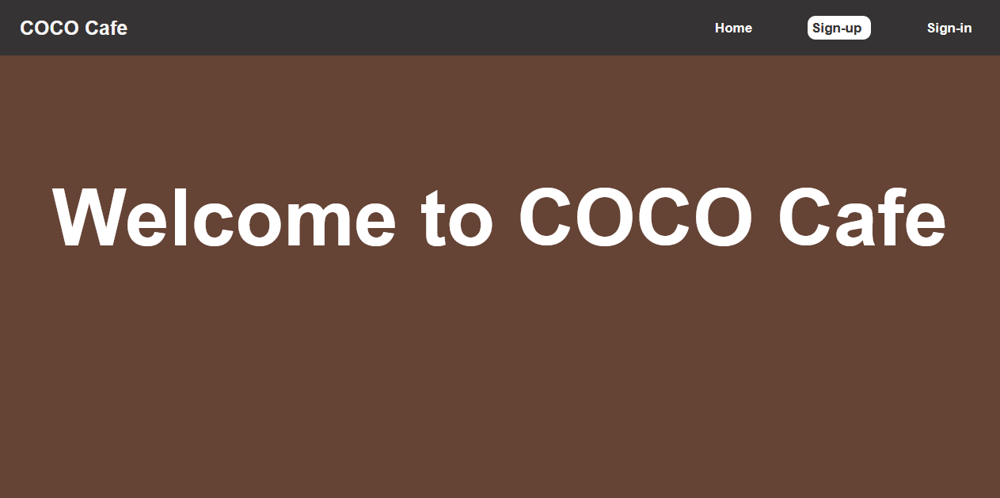
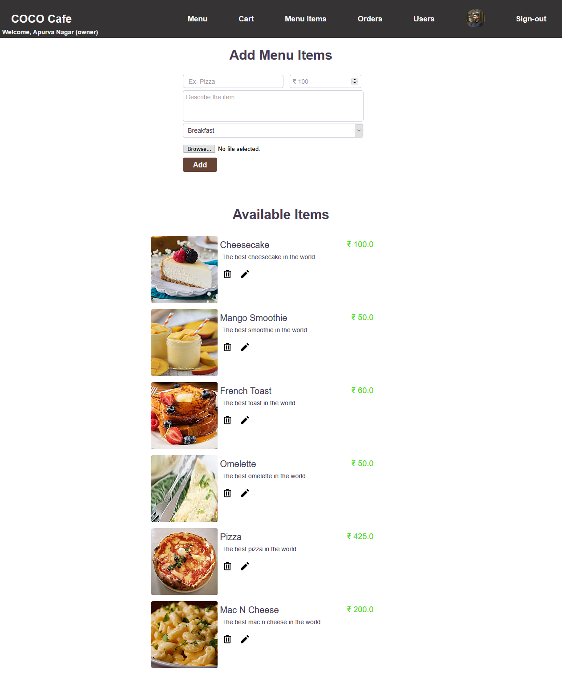

# CSF SaaS Capstone Project - Cafeteria Management System

This cafeteria management project was built as the capstone project for CSF SaaS.

## Tech stack used:

- Ruby (2.6.3)
- Rails (6.1.1)
- ERB for rendering templates.
- PostgreSQL

## Project Summary

A dual-user portal with owner and customer accounts that allows creating menus and placing orders.

## All Features

- ### Customer can:

  - Sign-up to the application, sign-in and sign-out.
  - Can see a menu of items that can be purchased.
  - Place an order by selecting items from the menu.
  - See all of their orders and the delivery status for each order.

- ### Owner can:
  - Create a new menu.
    - Add items to this menu.
    - Set a menu as active menu. (only the active menu is visible to the customer)
  - View, add, delete and edit menu items.
  - Place an order for walk-in customer.
  - See incoming orders and mark them as delivered.
  - See a list of users and their roles.

## Live Link

The project is live on Heroku [here](https://apurva-cafeteria-manager.herokuapp.com/).

Demo account credentials:

- Owner Account
  - ID: cafeowner@gmail.com
  - Password: 123456
- Customer Account
  - ID: michael@theoffice.com
  - Password: 123456

## Screenshots

